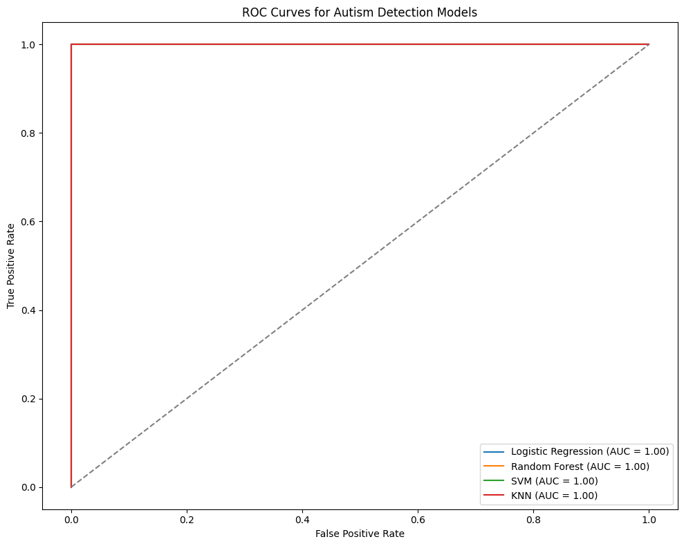

# Autism Detection with Machine Learning 🧠📊

## Overview
This project focuses on building machine learning models to classify autism-related data accurately. The goal was to identify patterns in the dataset and evaluate multiple models to find the most effective approach.

## Dataset
The dataset used in this project was sourced from Kaggle and contained features such as scores (A1_Score to A10_Score), demographics, and autism-related attributes.

Key properties:
- Total observations: **704**
- Features: **21**
- Target variable: **Class/ASD**

---

## Methodology

### 1. Data Preprocessing
- Handled missing values and inconsistencies (`?` replaced with NaN).
- Encoded categorical variables using **Label Encoding**.
- Normalized numerical features to improve model performance.
- Selected the most relevant features using **Random Forest Feature Importance**.

### 2. Exploratory Data Analysis (EDA)
- Generated correlation heatmaps to analyze relationships between features.
- Visualized the distributions of key features to identify patterns.
- Used scatter plots and box plots to understand class separability.

### 3. Model Training
Several machine learning models were trained and optimized:
- **Logistic Regression**
- **Random Forest**
- **Support Vector Machine (SVM)**
- **K-Nearest Neighbors (KNN)**

#### Optimization
- Hyperparameter tuning was performed using **GridSearchCV** for each model.
- Cross-validation was employed to ensure robustness and avoid overfitting.

### 4. Evaluation
- Evaluated models using metrics such as **accuracy**, **precision**, **recall**, and **F1-score**.
- Plotted **confusion matrices** for each model to visualize performance.
- Generated **ROC Curves** to compare the models' AUC (Area Under the Curve).

---

## Results
All models performed exceptionally well, with cross-validation results as follows:
- **Logistic Regression**: Accuracy = **99.79%**, Std Dev = **0.0041**
- **Random Forest**: Accuracy = **100%**, Std Dev = **0.0000**
- **SVM**: Accuracy = **100%**, Std Dev = **0.0000**
- **KNN**: Accuracy = **99.38%**, Std Dev = **0.0051**

The Random Forest and SVM models achieved perfect accuracy, demonstrating the dataset's separability and the models' effectiveness.

---

## Visualization

### ROC Curves
Below is the ROC Curve comparison for the models. This visualization highlights the performance of each model based on the True Positive Rate (TPR) and False Positive Rate (FPR).

---

## Tools and Libraries
- **Programming Language**: Python
- **Libraries Used**:
  - `pandas` and `numpy` for data manipulation.
  - `matplotlib` and `seaborn` for visualization.
  - `scikit-learn` for machine learning models and evaluation.

---

